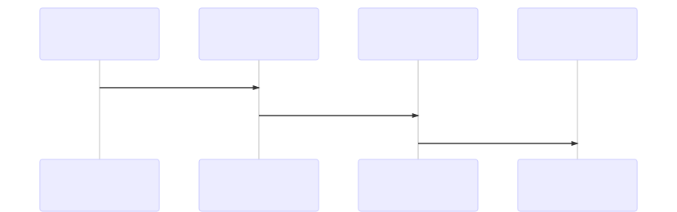

[](https://travis-ci.org/7flash/eth-letter-chain)
[](https://coveralls.io/github/7flash/eth-letter-chain?branch=master)

## ETH Letter Chain
> A chain letter is a message that attempts to convince the recipient to make a number of copies of the letter and then pass them on to a certain number of recipients.



1) Message owner creates reward in smart contract associated with chosen `Message(M)`
2) Message owner retrieves `A=(hash(M))` and send it to Alice asking her to distribute the Message
3) Alice claims A message receipt in smart contract, retrieves `B=(hash(A))`and send B to Bob
4) Bob claims B message receipt, retrieves `C=(hash(B))` and send C to John
5) Calvin claims C message receipt, requesting smart contract to verify hash chain`C == hash(hash(hash(M)))` and then distribute rewards to Alice, Bob and Calvin.

## Contribute
```
git clone https://github.com/7flash/eth-letter-chain.git
npm install
npm run test
```
